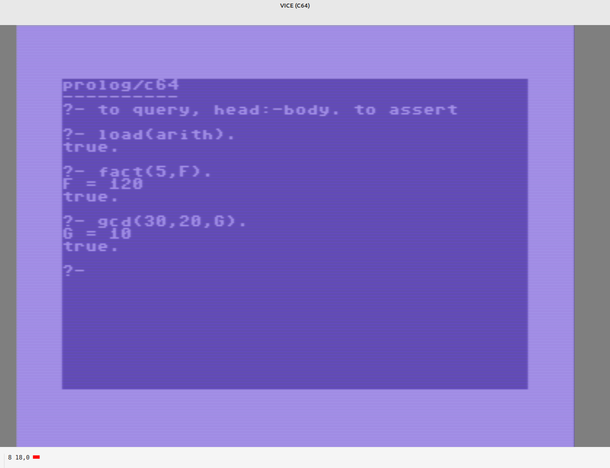

# Prolog/C64



A small Prolog interpreter for the Commodore 64, written in C and
6502 assembly and compiled with the [cc65](https://cc65.github.io/) toolchain.

## Features

- Full unification with occurs-free binding
- Backtracking with trail-based undo
- Clause database with up to 48 user-defined clauses
- Arithmetic: `+`, `-`, `*`, `/`, `mod`, unary `-`
- List syntax: `[H|T]`, `[1,2,3]`
- Built-in predicates: `true`, `fail`, `!`, `nl`, `write/1`, `=/2`, `\=/2`,
  `\+/1`, `not/1`, `is/2`, `=:=/2`, `=\=/2`, `</2`, `>/2`, `=</2`, `>=/2`,
  `call/1`, `assert/1`, `load/1`, `save/1`
- Up to 128 atoms (29 pre-defined), up to 16 variables per clause
- Signed 14-bit integers (-8192 to 8191)

## Building

Requires the [cc65](https://cc65.github.io/) toolchain and
[VICE](https://vice-emu.sourceforge.io/) for emulation.

```
make          # builds prolog.prg
make disk     # builds prolog.d64
```

Edit `CC65BIN` in the Makefile if cc65 is not at `/home/uhh/src/cc65/bin`.

## Running

Load the disk image in VICE:

```
x64 prolog.d64
```

Then on the C64:

```
LOAD "PROLOG",8,1
RUN
```

## How it works

### Memory layout

```
$0801-$4FFF   code, rodata, BSS, C stack  (~19 KB)
$5000-$57FF   trail stack                 (1024 entries x 2 B)
$5800-$5FFF   choice-point area           (reserved)
$6000-$67FF   environment area            (reserved)
$6800-$8FFF   heap / global stack         (5120 cells x 2 B = 10 KB)
$9000-$90FF   atom index table            (128 x 2 B offsets)
$9100-$93FF   atom string pool            (768 B)
$9400-$95FF   input buffer                (512 B)
```

### Term representation

Every term is a 16-bit **Cell**. The low 2 bits are the tag:

| Tag | Value (bits 15:2) | Meaning |
|-----|-------------------|---------|
| `REF` | heap word-index | variable (self-ref = unbound) |
| `STR` | heap word-index | compound term; points to functor cell |
| `ATM` | `arity<<8 \| atom` | atom or functor descriptor |
| `INT` | signed 14-bit integer | integer |

A compound `foo(a,b)` on the heap looks like:

```
[base]   ATM  arity=2, atom=foo   <- functor cell
[base+1] ATM  atom=a
[base+2] ATM  atom=b
```

A `STR` cell points to `base`; arguments are at `base+1 ... base+arity`.

### Hot path: deref (assembly)

`deref/1` is hand-written 6502 assembly (`asm/deref.s`). It follows a REF
chain until it reaches either a non-REF cell or a self-referential unbound
variable. The address computation avoids division:

```
byte_addr = HEAP_BASE + (cell >> 1)
```

This is a single 16-bit right-shift of the raw cell value (which already
encodes the word-index in bits 15:2), then the HEAP_BASE high byte ($68) is
added. Total: ~20 cycles per hop.

### Interpreter

`solve_g(goal, cont)` is a continuation-passing interpreter. The continuation
`cont` is the remaining goal to prove after `goal` succeeds.

The function is structured as a `restart:` loop. All built-ins and conjunction
steps that are logically tail calls become `goto restart` instead of a
recursive call, keeping the C stack shallow:

```c
// (A, B) with continuation C  ->  solve A with continuation (B, C)
goal = a;
cont = IS_ATOM0(cont, ATOM_TRUE) ? b : make_conj(b, cont);
goto restart;
```

Only genuine non-tail calls recurse: the body of a user-defined clause, the
probe inside `\+`, and the continuation after `!`.

When the interpreter tries a user-defined predicate, it iterates over matching
clauses. Each clause is **renamed** (fresh variables) via a small renaming
table before unification. On failure or backtrack the trail is unwound and the
heap mark is restored.

Cut (`!`) is encoded in the return value: bit 0 = success, bit 1 = cut seen.
A clause selector stops trying alternatives as soon as bit 1 is set.

### Clause database

Clauses are stored in a flat array of 48 `ClauseEntry` records, each holding
the functor index, arity, and head/body cells. The heap region below
`clause_top` is permanent and is never reclaimed by query backtracking.

---

## REPL usage

At the `?-` prompt:

- Type a **query** (no `:-` prefix) to execute it.
- Type a **clause** (`head :- body.` or `fact.`) to add it to the database.
- Variables start with an uppercase letter or `_`.
- All input must end with `.` (added automatically if missing).
- Press `DEL` to backspace.

---

## Examples

### Simple facts and queries

```prolog
?- animal(dog).
ok.

?- animal(cat).
ok.

?- animal(X).
X = dog
true.
```

### Rules

```prolog
?- parent(tom, bob).
ok.

?- parent(bob, ann).
ok.

?- ancestor(X,Y) :- parent(X,Y).
ok.

?- ancestor(X,Y) :- parent(X,Z), ancestor(Z,Y).
ok.

?- ancestor(tom, ann).
true.

?- ancestor(tom, X).
X = bob
true.
```

### Arithmetic

```prolog
?- X is 6 * 7.
X = 42
true.

?- X is (10 + 5) / 3.
X = 5
true.

?- 3 + 4 =:= 8 - 1.
true.
```

### Factorial

```prolog
?- fact(0, 1) :- !.
ok.

?- fact(N, F) :- N > 0, N1 is N - 1, fact(N1, F1), F is N * F1.
ok.

?- fact(5, X).
X = 120
true.
```

### Lists

```prolog
?- member(X, [X|_]).
ok.

?- member(X, [_|T]) :- member(X, T).
ok.

?- member(X, [a, b, c]).
X = a
true.

?- append([], L, L).
ok.

?- append([H|T], L, [H|R]) :- append(T, L, R).
ok.

?- append([1, 2], [3, 4], X).
X = [1,2,3,4]
true.
```

### Length of a list

```prolog
?- length([], 0).
ok.

?- length([_|T], N) :- length(T, N1), N is N1 + 1.
ok.

?- length([a, b, c], N).
N = 3
true.
```

### Negation as failure

```prolog
?- \+(fail).
true.

?- \+(member(d, [a, b, c])).
true.
```

### Write and nl

```prolog
?- hello :- write(hello), nl.
ok.

?- hello.
hello
true.
```

### Towers of Hanoi

```prolog
?- move(F,T) :- write(F), write(->), write(T), nl.
ok.

?- hanoi(1,F,T,_) :- !, move(F,T).
ok.

?- hanoi(N,F,T,V) :- N>1, N1 is N-1, hanoi(N1,F,V,T), move(F,T), hanoi(N1,V,T,F).
ok.

?- hanoi(N) :- hanoi(N,left,right,mid).
ok.

?- hanoi(3).
left->right
left->mid
right->mid
left->right
mid->left
mid->right
left->right
true.
```

---

## Sample programs

The `progs/` directory contains three programs that can be loaded at runtime
with `load(name)`:

| File | Contents |
|------|----------|
| `lists.pl` | `member`, `append`, `length`, `last`, `nth`, `reverse` |
| `arith.pl` | `fact` (factorial), `fib`, `gcd`, `between`, `abs` |
| `hanoi.pl` | Towers of Hanoi (`hanoi(N)`) |

Load and run example:

```
?- load(hanoi).
?- hanoi(3).
left->right
...
true.
```

Save the current database back to disk:

```
?- save(mydb).
```

---

## Limitations

- **No semicolon (`;`) choice points** at the top level -- disjunction is
  parsed but not executed by the interpreter.
- **First solution only** -- the REPL prints the first solution and stops;
  there is no `;` prompt to ask for more.
- **No assert of rules at the prompt** -- `assert/1` copies the term to
  permanent heap but the REPL's clause-entry path (`head :- body.`) is
  the preferred way to add rules.
- **No I/O beyond `write` and `nl`** -- no `read`, `atom_chars`, etc.
- **No floats** -- integers only (-8192 to 8191).
- **48 clause limit**, **128 atom limit**, **16 variables per clause**.
